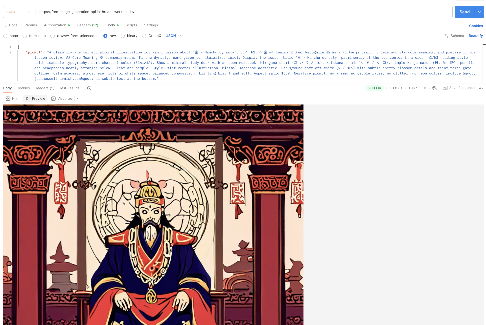

# 🔥 Free AI Image Generation API

Turn text into images without spending a dime. This repo deploys your own private image-generation endpoint on **Cloudflare Workers**, powered by Cloudflare's **Workers AI** free tier — up to **100,000 generations a day**, no GPU, no bill, no excuses.

## 🖼️ Example Output



*Generated by a single POST request to the deployed Worker — no editing, straight from the API.*

## 💥 Why This Slaps

- 🆓 **100,000 free calls/day** — Cloudflare Workers AI free tier
- 🛰️ **Zero infrastructure** — no servers to babysit, no scaling to worry about
- 🗝️ **Locked down** — your own API key gates every request
- 🎛️ **Model flexibility** — swap in any supported Workers AI image model
- 🧬 **Deploy in minutes** — copy, paste, done

## 🧨 How It Works

1. 📡 You deploy a Cloudflare Worker using the `worker.js` in this repo
2. 🚦 The Worker exposes a single POST endpoint that turns a prompt into an image
3. 🔐 Every request is gated behind your own API key
4. 🧠 Cloudflare's free AI models do the actual image generation — you just collect the output

## 🛠️ Setup — Get It Running

### 1. 🛰️ Grab a Cloudflare Account

No account yet? Sign up at Cloudflare — it's free and takes two minutes.

### 2. ⚙️ Spin Up a New Worker

- Head to the Cloudflare Workers dashboard
- Hit **"Create application"** → **"Create Worker"**
- Name it something like `free-image-generation-api`
- Click **"Deploy"** to stand up the default Hello World worker

### 3. 🧬 Swap In the Real Code

Open the worker editor, delete the Hello World boilerplate, and paste in the `worker.js` code from this repo. Click **"Save and Deploy"**.

### 4. 🗝️ Set Your API Key

- In the worker dashboard, go to **Settings → Variables**
- Under **Environment Variables**, click **Add variable**
- Name: `API_KEY`
- Value: a strong secret only you know
- Click **"Save and Deploy"**

### 5. 🧠 Flip On Workers AI

In the Cloudflare dashboard, go to **Workers & Pages → AI** and enable Workers AI for your account. The free tier is more than enough to get started.

### 6. 🔗 Bind AI to Your Worker

This step is easy to miss — **skip it and your worker can't reach any AI models.**

- Back in your worker's dashboard, go to **Settings → Variables**
- Scroll to **Service bindings** and click **Add binding**
- Variable name: `AI`
- Service: **Workers AI**
- Click **"Save and Deploy"**

### 7. 🌍 Grab Your Worker URL

Your live endpoint will be:

```text
https://<your-worker-name>.<your-subdomain>.workers.dev
```

You'll find the exact URL right on your worker's dashboard.

## 🚀 Usage

### 🖥️ cURL

```bash
curl -X POST https://<your-worker-name>.<your-subdomain>.workers.dev \
  -H "Authorization: Bearer your-secret-api-key" \
  -H "Content-Type: application/json" \
  -d '{"prompt": "A cute robot cooking breakfast"}' \
  --output image.jpg
```

### 🖼️ JavaScript

```javascript
const res = await fetch("https://<your-worker-name>.<your-subdomain>.workers.dev", {
  method: "POST",
  headers: {
    "Authorization": "Bearer your-secret-api-key",
    "Content-Type": "application/json",
  },
  body: JSON.stringify({ prompt: "A futuristic city in the clouds" }),
});
const blob = await res.blob();
const img = document.createElement("img");
img.src = URL.createObjectURL(blob);
img.style.height = "500px";
document.body.appendChild(img);
```

## 🧾 Good to Know

- 💰 **Free tier**: Cloudflare Workers AI gives you 100,000 AI requests/day at no cost. Check Cloudflare's pricing page for the fine print.
- 🎛️ **Models**: Swap the model used in `worker.js` for any other Workers AI image model — see the comments in the file for the full list.
- 🔐 **Security**: Treat your API key like a password. Rotate it if you ever suspect it's leaked.

---

**🔥 Deploy your own free AI image generation API in minutes — and start turning words into pictures.**
