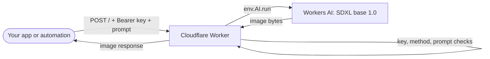

# Free AI Image Generation API

Your own private text-to-image endpoint on Cloudflare Workers: one 51-line Worker that turns a prompt into an image
with Workers AI (Stable Diffusion XL), gated by your API key.


*A request to a deployed copy of this Worker in Postman: `200 OK`, about 11 seconds, image shown in the response
pane.*

## What it does

- Exposes one endpoint: `POST /` with a JSON body `{"prompt": "..."}`
- Rejects any request without `Authorization: Bearer <API_KEY>`
- Generates the image with Workers AI model `@cf/stabilityai/stable-diffusion-xl-base-1.0`
- Returns the image bytes directly in the response

**Why:** to get images from scripts, apps and automations (n8n, Make, your own backend) without running a GPU
server or signing up for a per-image API. It runs on your own Cloudflare account, inside Cloudflare's free
allowances.

## Features

- No servers: a single Cloudflare Worker
- Private by default: every request needs your bearer key
- Clear errors: `401`, `405`, `400` and `500` with JSON messages
- Works from anything that can send an HTTP POST

## Architecture



Nothing is stored: no database, no bucket, no logs beyond Cloudflare's own.

## Quick start (dashboard)

1. **Create a Worker.** In the Cloudflare dashboard go to **Workers & Pages → Create → Worker**, name it (for
   example `free-image-generation-api`) and deploy the default "Hello World".
2. **Paste the code.** Open **Edit code**, replace everything with [`worker.js`](worker.js), and deploy.
3. **Add your key as a secret.** In the Worker's **Settings → Variables and Secrets**, add `API_KEY` with type
   **Secret** and a long random value (for example from `openssl rand -hex 32`).
4. **Bind Workers AI.** In **Settings → Bindings**, add a **Workers AI** binding with the variable name `AI`. Without
   it the code can't reach any model.
5. **Deploy** and copy the URL: `https://<your-worker-name>.<your-subdomain>.workers.dev`.

Cloudflare's dashboard labels change from time to time; the two things that matter are a secret named `API_KEY`
and a Workers AI binding named `AI`.

## Quick start (Wrangler, optional)

The repo has no Wrangler config yet. To deploy from the command line, add a `wrangler.toml` next to `worker.js`:

```toml
name = "free-image-generation-api"
main = "worker.js"
compatibility_date = "2026-07-11"

[ai]
binding = "AI"
```

Then:

```bash
npx wrangler login
npx wrangler secret put API_KEY
npx wrangler deploy
```

## Environment

| Name | Kind | Purpose |
|---|---|---|
| `API_KEY` | Secret | The bearer key every request must send |
| `AI` | Workers AI binding | Gives the Worker access to Workers AI models |

## Usage

### cURL

```bash
curl -X POST "https://<your-worker-name>.<your-subdomain>.workers.dev" \
  -H "Authorization: Bearer <YOUR_API_KEY>" \
  -H "Content-Type: application/json" \
  -d '{"prompt": "A cute robot cooking breakfast"}' \
  --output image.jpg
```

### JavaScript (browser or Node 18+)

```javascript
const res = await fetch("https://<your-worker-name>.<your-subdomain>.workers.dev", {
  method: "POST",
  headers: {
    "Authorization": "Bearer <YOUR_API_KEY>",
    "Content-Type": "application/json",
  },
  body: JSON.stringify({ prompt: "A futuristic city in the clouds" }),
});
if (!res.ok) throw new Error((await res.json()).error);
const blob = await res.blob();
```

Don't put your key in front-end code that other people can see; call the Worker from your own backend or
automation.

### Responses

| Status | When | Body |
|---|---|---|
| `200` | Image generated | Image bytes (`Content-Type: image/jpeg`) |
| `400` | No `prompt` in the JSON body | `{"error": "Prompt is required"}` |
| `401` | Missing or wrong bearer key | `{"error": "Unauthorized"}` |
| `405` | Not a `POST` to `/` | `{"error": "Not allowed"}` |
| `500` | The model call failed | `{"error": "Failed to generate image", "details": "..."}` |

Only `prompt` is sent to the model; size, steps, seed and negative prompt use the model's defaults. Cloudflare's
docs don't state SDXL's output format, so check the bytes if you need to know whether you got JPEG or PNG.

## Changing the model

The model is set in `worker.js` (`env.AI.run(...)`). The comment above it lists other Workers AI image models, but
they are not drop-in replacements:

- **FLUX.1 [schnell]** (`@cf/black-forest-labs/flux-1-schnell`; the comment in `worker.js` misspells it) returns
  JSON with a base64 `image` field, so decode it before returning the response.
- **Img2img and inpainting** models need an input image (and a mask), not just a prompt.

## Free tier and limits

This runs inside your own Cloudflare account. At the time of writing, Cloudflare's Workers AI pricing page lists a
free allocation of **10,000 Neurons per day**, and the Workers Free plan allows 100,000 requests per day; how many
images that covers depends on the model. Check
[Workers AI pricing](https://developers.cloudflare.com/workers-ai/platform/pricing/) for current numbers.

## Security notes

- Use a long random key and store it as a secret. Rotate it if it leaks.
- Make sure `API_KEY` is set: if it is missing, the check compares against `Bearer undefined`.
- There is no rate limiting or per-user quota. Before sharing the endpoint, add Cloudflare rate limiting rules or a
  per-key counter.
- Error responses include the model error message; remove `details` if you don't want that exposed.

## Demo

- Demo video: _coming soon_ <!-- TODO: add the YouTube link -->
- Project write-up: _coming soon_ <!-- TODO: https://avnishyadav.com/projects/free-ai-image-generation-api once published -->

## License

No license file has been added yet. <!-- TODO (owner): add a LICENSE file and update this line. -->

## Author

Built by **Avnish Yadav**, AI automation engineer.

- Website: [avnishyadav.com](https://avnishyadav.com)
- YouTube: [@avnishcodes](https://www.youtube.com/@avnishcodes)
- LinkedIn: [avnishyadav25](https://in.linkedin.com/in/avnishyadav25)
- GitHub: [avnishyadav25](https://github.com/avnishyadav25)
